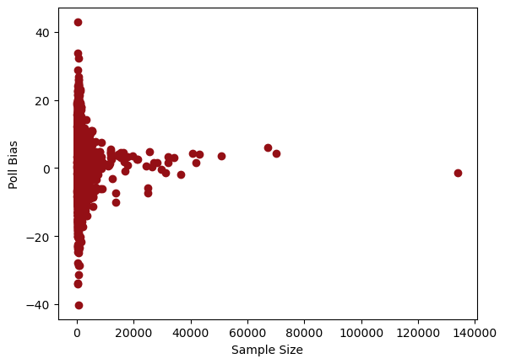
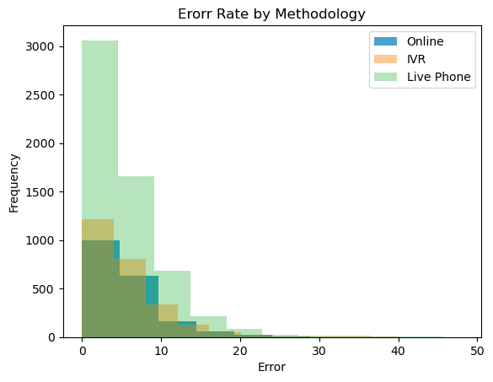
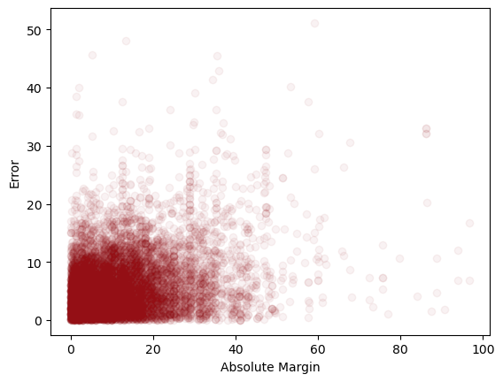
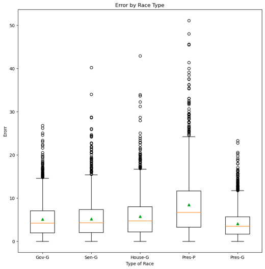
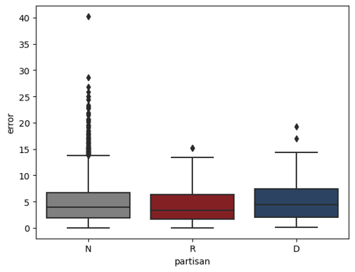
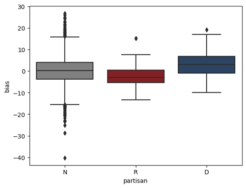

# Executive Summary

## Central Question
Polling is a vital tool in electoral politics that provides an overview of the current dynamics in a political race. The results of polls not only provide the public with an understanding of which races will be the most competitive and important in an election cycle, but they also allow partisan organizations and individual donors to effectively divide their resources and invest in the most vital races. However, recent polling inaccuracies in high-profile elections, most notably the 2016 presidential election, have damaged the public's perception and trust of political polling. As a result, I decided to explore how we can understand the performance of polling in past election cycles to evaluate the quality of future polls. In short, what makes a good poll?

## Our Data
To conduct my analysis, I used FiveThirtyEight’s Pollster Rating Dataset [1]. This dataset stores information about polls for United States elections between 1998 and 2022. It includes every poll that covered presidential, gubernatorial, senatorial, and congressional elections within three weeks of the election date. It is restricted to that time horizon to ensure that I'm measuring the polls’ ability to predict the current state of public opinion rather than their ability to predict the future.

## Methodology

### Sample Size

    

As we would expect from statistical theory, I found that larger sample sizes reduce the variability of polling predictions. Polls with greater than 4,000 responses all have under 12% error, and polls with greater than 7,000 responses all have under 10% error. Neither of these numbers are particularly good (the average error rate is 5.5%), but they do greatly reduce the total range of the error, which was originally up to 40%.

### Polling Methods

    

There were six types of polling methodologies included in the dataset, including live phone interviews, IVR (interactive voice response, or "robopolls"), polls conducted by mail, online polls, text message polls, and face-to-face interview polls. Some polls used a combination of two or more of these methods. I first explored whether there was a significant difference in mean poll error between the polls that used only one type of methodology. I limited my analysis to methods with 50 or more polls in the dataset to ensure that I could draw valid statistical conclusions from ANOVA testing. This meant that only live phone, IVR, and online polls were included in this part of the analysis. I found that there was no statistically significant difference in the mean error produced by these polls. Although live phone interviews are considered the gold standard for polling [2], my analysis showed that live phone polls did not tend to yield more accurate results than other methods. When I looked at all polling methods with 50 or more polls, including those that involved two or more of the basic methods, I found that there was still no statistical difference in the mean error by polling method, except that polls conducted through a combined live phone/online method had a higher mean error than other methods. This method combination was on the lower end of the count of polls conducted, with a total of 141 polls conducted via this combined method.

## Setting

### Competitiveness

    

Contrary to my intuition, I found that more competitive races do not correlate with more accurate polls. One would expect that if a race were within a few points, there would be fewer ways to predict its outcome, and as a result, polls should be more accurate. However, this is not the case. There is no correlation between a race’s margin and the poll’s error rate.

### Location
Though the competitiveness of a race does not affect its error rate, the competitiveness of the race’s location does. My analysis of presidential races by state shows that the polls with the lowest mean error are conducted in competitive swing states that have significant electoral value, and the polls with the highest error rates are conducted in states with no competition. For example, the lowest-error state is Georgia, which was once solidly Democratic but has shifted to Republican and is a toss-up in most elections. By contrast, the highest-error state is Hawaii, which consistently votes Democrat. This result makes sense because every interested party has finite resources, and they would naturally want to focus on areas that can have the largest impact on the outcome of an election.

### Race Type

    

There were five race types in the dataset: presidential, Senatorial, Gubernatorial, and House general elections, and presidential primary elections. I found that polls conducted regarding presidential general elections tended to be the most accurate. Based on pairwise t-testing with a Bonferroni correction, I found that presidential general election polls were significantly more accurate than polls for any other race type, followed by Senatorial and Gubernatorial races, between which no significant difference existed. House race polls had a greater mean error than any other type of general election poll, but the greatest difference in mean error existed between House polls and presidential primary polls. Primary polls tend to feature the greatest number of candidates, among whom no party differentiation exists, creating a less informed electorate. This lack of party differentiation also decreases the relative "importance" of primary elections, which can decrease election turnout, making it more difficult for pollsters to garner an accurate picture of the electorate for primary races.

## Pollsters

### Partisan Error

    

Some polls are conducted by self-identified partisan pollsters. Such polls may be sponsored by local parties or other Democrat- or Republican-aligned organizations and are commissioned to give the party, or the candidate themselves, an inside view of where the race stands to help determine whether new investments are needed in the race or if campaign strategies should be altered. They may also be used to recruit new donors, as polls showing a close race with a narrow lead for a candidate can convince individual donors to donate and help push the candidate toward victory. I found that the median error did not significantly differ between Republican, Democratic, and non-partisan polls. I predicted that partisan pollsters would likely have a greater error rate than non-partisan pollsters since they are often commissioned with a political agenda in mind.

### Partisan Bias

    

Despite the similarity in error between partisan and non-partisan polls, I did not find the same similarity in bias. Bias demonstrates how much a poll overestimated one party’s candidate; in the dataset, a positive bias indicated that the poll overestimated the Democrat, while a negative bias indicated that the Republican candidate’s performance was overestimated. Unsurprisingly, Democratic partisan pollsters tended to have a Democratic bias, while Republican pollsters displayed a bias towards Republican candidates. Non-partisan pollsters had a median bias of approximately 0, with bias normally distributed around this median. In short, partisan pollsters tend to overestimate the performance of their own candidates in their polls.

## Key Takeaways
1.  Be wary of small sample sizes. Large samples may not guarantee quality polling, but small sample sizes greatly reduce reliability.
2.  More important races have better polls. Understand where your election is taking place and who is involved. If a race is more significant, then you can rely more on its polling.
3.  Partisan polls lean toward their affiliation. Keep track of who is conducting a poll and take their biases into account. The polls may not be less accurate, but they are more likely to overestimate their own party.

## References

[1] FiveThirtyEight, Mar. 2022, "Pollster Ratings," FiveThirtyEight.com. [Online]. Available: https://github.com/fivethirtyeight/data/tree/master/pollster-ratings
[2] Quinnipiac University, Jan. 2023, "Methodology," poll.qu.edu. [Online]. Available: https://poll.qu.edu/methodology/

